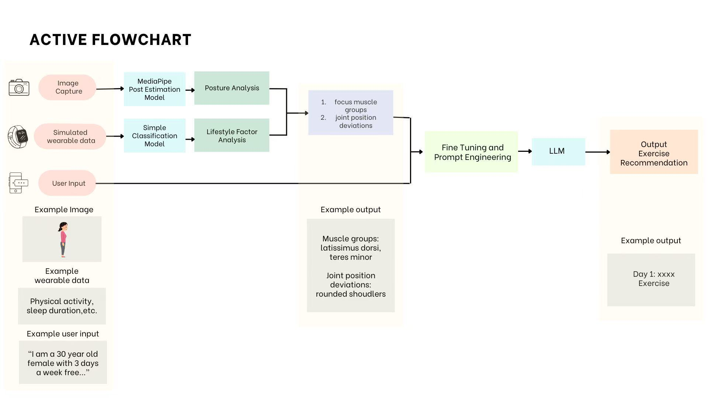

# ActIve

## Description

The **ActIve** is an **on-device AI application** for the purpose of **personalied exercise generation**. It is designed to help users improve their posture and prevent muscle imbalances through **real-time posture analysis** and **personalized exercise recommendations** using personal factors. This application runs entirely on **Snapdragon X Elite Copilot+ PC** without internet, ensuring **offline functionality and privacy protection**.



### Key Features

- **Posture Analysis (MediaPipe)**: Detects **postural imbalances** using real-time pose estimation from a webcam.
- **Wearable Data Integration**: Simulates real-world wearable device metrics (eventually we hope we can use real data as part of our application).
- **LLM-Powered Personalized Exercise Generator (Llama v3.2-1B-Chat)**: Generates **muscle imbalance priority ranking** and a **step-by-step corrective exercise plan**.
- **On-Device AI Processing**: Utilizes **ONNX Runtime & ollama** to run Llama models **fully offline**.
- **Privacy-Preserving & Edge AI**: No internet connection is required—**all user data remains local**.

### How It Works

**Step 1: Posture Detection** 📸

- The system captures **real-time images** of the user’s posture via a webcam and processes them using **MediaPipe Pose Estimation**.
- Identifies key postural issues such as **forward head posture, shoulder asymmetry, pelvic tilt, and knee misalignment**.
- Calculates **joint angles** to detect misalignment and muscle imbalances.
- Generates a **structured posture deviation report**.

**Step 2: Wearable Device Data Integrationy** 📊

- The system simulates **wearable device metrics** (or retrieves real-world sensor data) to **enhance posture analysis**.
- Factors considered: sleep duration, sitting duration, daily steps & activity levels, heart rate, etc.
- This data is **fed into a neural network (LifestyleNN)** that predicts **potential muscle weaknesses** based on lifestyle habits.
- This portion is still under development

**Step 3: Muscle Weakness Priority Ranking (LLM)** 🏆

- The **first LLM (Llama v3.2-1B-Chat)** takes the previous output and determines:
- **Which muscle groups require the most attention** for strengthening.
- **Priority ranking of muscles** that need targeted exercise for posture correction.

**Step 4: Personalized Exercise Plan Generation** 🏋️

- The **second LLM model** refines the **muscle group analysis** by integrating **user-specific data**:
- **User Profile** (age, gender, occupation, daily routine)
- **Training Preferences** (exercise frequency, available time, prior injuries)
- The model then generates a **step-by-step exercise plan**

## Dependencies:

- ONNXRuntime
- opencv-python # OpenCV for computer vision tasks
- mediapipe # MediaPipe for human pose estimation
- ollama # Ollama CLI for AI model interaction

## Installation Guide (Snapdragon X Elite)

This guide ensures **ActIve** runs smoothly on **Snapdragon X Elite Copilot+ PC**.

### 1. Prerequisites

Before installing, ensure your system has:

- **Python 3.10.11**
- **pip (latest version)**
- **Git**
- **Ollama CLI (Windows ARM64)**
- **ONNX Runtime (Qualcomm QNN)**
- **MediaPipe ONNX (Qualcomm AI Hub)**
- **OpenCV (headless, no GUI)**

---

### 2. Clone the Repository

```sh
git clone https://github.com/ShirleyFang/ActIve.git
cd Active_version2
```

### 3. Set Up the Environment

Choose between using a virtual environment (recommended) or installing dependencies globally.

- **Option 1: Virtual Environment (Recommended)**

```sh
python -m venv venv
```

Activate the virtual environment

- Windows (CMD / PowerShell)

```sh
venv\Scripts\activate
```

- Windows (Git Bash)

```sh
source venv/Scripts/activate
```

- **Option 2: Install Globally**

If you prefer not to use a virtual environment, skip activation and proceed to the next step.

### 4. Install Dependencies

Run the following command to install all required dependencies:

```sh
pip install -r requirements.txt
```

What’s Included?

- **onnxruntime-qnn** → Qualcomm-optimized ONNX Runtime
- **opencv-python-headless** → OpenCV without GUI dependencies (for better ARM64 compatibility)
- **numpy** → Numerical computing
- **torch** → PyTorch for AI model execution

### 5. Install Ollama (Windows ARM64)

1. Download Ollama for Windows ARM64
   👉 [Download Ollama](https://ollama.com/)
2. Install Ollama
3. Verify the installation:

```sh
ollama --version
```

4. Pull the Llama 3.2 model:

```sh
ollama pull llama3.2:1b
```

### 6. Run the Application

Start ActIve

```sh
cd src
python main.py
```

What it does:

- Captures real-time posture data using a webcam
- Analyzes postural deviations with MediaPipe ONNX
- Predicts muscle imbalances via LifestyleNN
- Generates a customized corrective exercise plan using Llama 3.2 AI

### License:

    This project is for educational and research purposes only.
